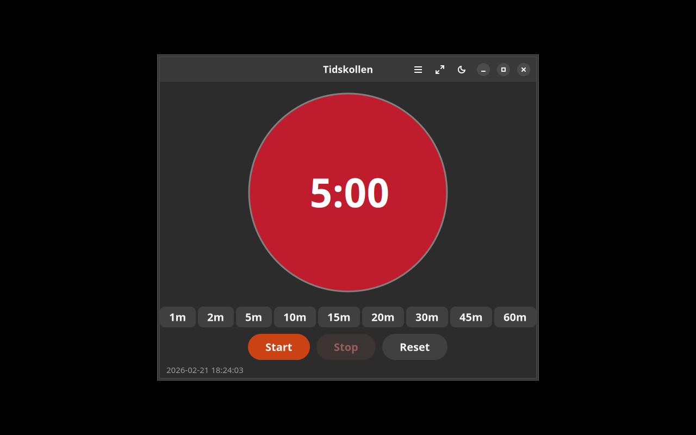

# Tidskollen


## Screenshots

| English | Svenska |
|---------|---------|
|  |  |

[](https://github.com/yeager/tidskollen/releases)
[](https://www.gnu.org/licenses/gpl-3.0)
[](https://www.transifex.com/danielnylander/tidskollen/)

Visual time timer for classrooms and children with autism — GTK4/Adwaita.

> **For:** Children with autism, ADHD, or DLD who benefit from visual time management. Also useful in classrooms and therapy settings.


## Features

- **Visual timer** — large, clear countdown display
- **Color-coded** — green/yellow/red time zones
- **Presets** — common intervals (5, 10, 15, 30 min)
- **Custom timer** — set any duration
- **Sound alerts** — notification when time is up
- **Dark/light theme** toggle

## Installation

### Debian/Ubuntu

```bash
echo "deb [signed-by=/usr/share/keyrings/yeager-keyring.gpg] https://yeager.github.io/debian-repo stable main" | sudo tee /etc/apt/sources.list.d/yeager.list
curl -fsSL https://yeager.github.io/debian-repo/yeager-keyring.gpg | sudo tee /usr/share/keyrings/yeager-keyring.gpg > /dev/null
sudo apt update && sudo apt install tidskollen
```

### Fedora/openSUSE

```bash
sudo dnf config-manager --add-repo https://yeager.github.io/rpm-repo/yeager.repo
sudo dnf install tidskollen
```

### From source

```bash
git clone https://github.com/yeager/tidskollen.git
cd tidskollen && pip install -e .
tidskollen
```

## Translation

Help translate on [Transifex](https://www.transifex.com/danielnylander/tidskollen/).

## License

GPL-3.0-or-later — see [LICENSE](LICENSE) for details.

## Author

**Daniel Nylander** — [danielnylander.se](https://danielnylander.se)
